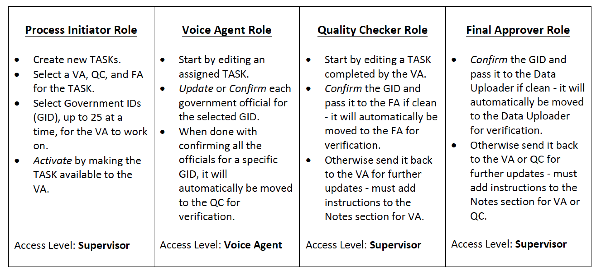

/*
Title: Admin System
Sort: 1
*/

The PowerAlmanac Admin System (also referred to as **iCube**) used by voice agents in the Philippines (OWC) is hosted on Amazon Web Service (AWS) at: [http://www.poweralmanac.com/jxarh/](http://www.poweralmanac.com/jxarh/)

##Roles##

There are 4 basic roles in the PA Admin System: **Process Initiator** (PI), **Voice Agents** (VA), **Quality Checker** (QC), and **Final Approver** (FA). Ron and Nick have full Administrator access to the PA Admin System.

New Voice Agent accounts are managed by OWC account holders with access level of Supervisor.

##Workflow##

Workflow is from VA to QC (and maybe back to VA if errors found) to **FA** (and maybe back to VA/QC for errors). Once a government is in the FA stage, it will get processed every Sunday (double check with Sagi's scripts) and moved into production (Data Uploader) upon successful build.

For each Government ID, free text **Notes** can be left by each agent to document their actions and especially when a task is being sent back to a previous flow state.

##Main Screens##

There are three main tabs available for OWC folks with Supervisor level access. Voice Agents only have access to two tabs. Administrators get five tabs.

###Voice Agents Primary Screens###

In the **Actions** column (first), if there is a red flag () displayed, it means **REWORK** is needed. This happens when a Government ID task is sent back from the QC to the VA or from the FA to the VA or QC. The VA could focus on these with higher priority.

Productivity of a VA agent is calculated by Sagi's stored procedure and is based on the number of officials per government ID and how long it takes for the voice agent to finish updating/confirming - the completed task.

All the fields are simple and easy to change (minimizing errors) with the UI. Once modified and saved, they are highlighted in yellow (see QC screens for examples).

###Process Initiator Primary Screens###

All government IDs selected by the PI for work by the VAs are usually based on similar zip codes (and similar time zones) so it is more productive for the assigned VA.

###Quality Check Primary Screens###

The changes made by voice agents are highlighted in yellow so the QC can verify and move it along the process work as quickly as possible.

###Final Approver Primary Screens###

[Final Approver Dashboard](images/fa-dashboard.jpg)

Government IDs that are confirmed and placed into the DU Status (Data Uploader) are the only ones that will be processed on a weekly schedule to make it to the production database.

###Additional Administrator Screens###

We can get a higher level picture of the state of the maintenance with a couple of additional screens.

#Weekly Updates#

The data verification team in the Philippines finishes all updates using the PA Admin System before the weekly Sunday updates. All committed changes (all Government IDs in the Data Uploader work queue) are push from the iCube Government databases to the production Government databases. And the rest of the scripts to create the Analyze and Search meta-tables get run after that.